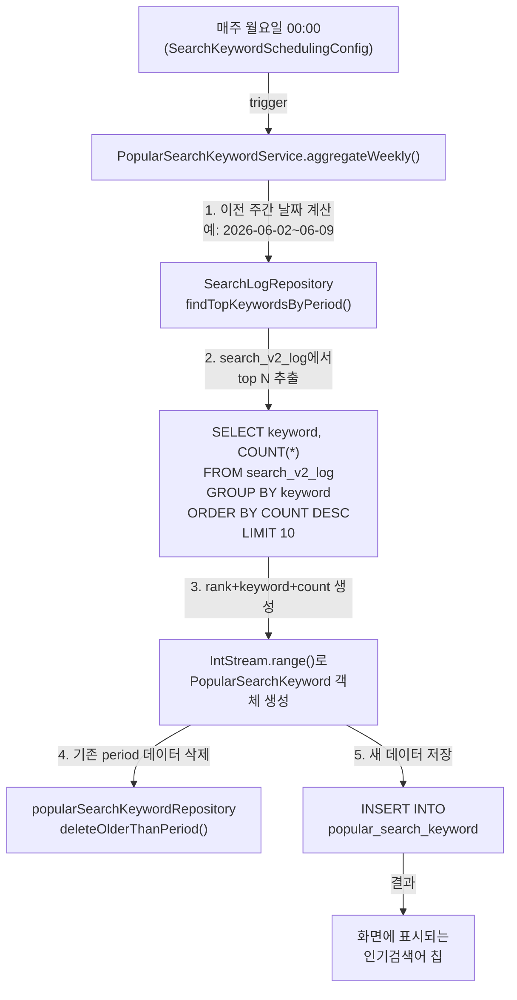

# 🏘️ NeighborTrade - 동네 직거래 커뮤니티 플랫폼

## 🎯 프로젝트 소개

🏷 **프로젝트 명 : NeighborTrade (동네직거래)**

🗓️ **프로젝트 기간 : 2026.05 ~ 진행 중**

👥 **구성원 : 개인 프로젝트**

---

### ✅ 서비스 소개

> 동네에서 직거래로 물건을 사고팔 수 있는 위치 기반 커뮤니티 플랫폼

사용자는 자신의 동네(근처 지역)를 기반으로 중고 물품을 등록·판매하고, 다른 이웃들의 상품을 탐색하며 안전하게 거래할 수 있습니다.
관리자는 플랫폼의 콘텐츠와 거래 내역을 관리하며, 인기검색어 집계를 통해 사용자 동향을 파악합니다.

#### 핵심 특징

- **위치 기반 거래**: 사용자의 동네를 기반으로 근처 판매자와 상품 발견
- **카테고리별 탐색**: 전자제품, 의류, 가구 등 다양한 카테고리 필터링
- **검색 로깅 및 인기검색어**: 사용자 검색 기록 수집 및 주간 인기검색어 제공
- **반응형 디자인**: 데스크톱·태블릿·모바일 모든 기기에서 최적화된 경험

---

### 👥 서비스 대상

- 동네에서 물건을 사고팔고 싶은 개인 판매자 및 구매자
- 안전하고 편리한 중고거래 경험을 원하는 사용자
- 지역 커뮤니티 활성화에 관심 있는 주민

---

## 🛠 기술 스택

### Backend

<p>
  
  
  
  
  
  
</p>

### Frontend

<p>
  
  
  
  
  
</p>

### Database & GIS

<p>
  
  
  
  
</p>

### Build & DevOps

<p>
  
  
  
</p>

### Tools & Collaboration

<p>
  
  
</p>

---

## ✨ 핵심 기능

### 👤 일반 사용자 시나리오

#### 1단계 — 회원가입 / 로그인

- 이메일·비밀번호로 직접 회원가입하거나, **카카오 · 네이버 소셜 로그인**으로 간편 가입
- 소셜 로그인 시 최초 1회 자동 회원가입, 이후 동일 이메일로 재접속 시 기존 계정과 자동 연동
- 비로그인 사용자도 중고거래 목록·상세 페이지는 자유롭게 조회 가능

#### 2단계 — 위치 선택 & 중고거래 상품 탐색

- 자신의 **동네를 선택**하고, 해당 지역의 판매 상품 목록 조회
- **카테고리별 필터링** (전자제품, 의류, 가구, 도서 등)
- **검색 기능**: 키워드로 상품 검색 시 검색 기록 저장 및 주간 인기검색어 제공

#### 3단계 — 상품 판매 (판매자)

- 상품 정보 입력 (제목, 설명, 카테고리, 가격, 상태)
- **상품 이미지 업로드** (여러 장 지원)
- 거래 상태 관리 (판매중 / 예약중 / 판매완료)
- **끌올 기능**: 24시간마다 한 번 상품 노출 시간 갱신

#### 4단계 — 즐겨찾기 & 관심 상품 관리

- 마음에 드는 상품을 **즐겨찾기** 추가
- 즐겨찾기한 상품을 한눈에 조회 및 관리

#### 5단계 — 검색 기록 조회 & 인기검색어 활용

- 자신의 **최근 검색 기록** 조회 및 삭제
- 화면 상단에 **주간 인기검색어 칩** 표시로 트렌드 상품 발견

---

### 🛠️ 관리자 시나리오

#### 1단계 — 중고거래 상품 관리

- 사용자가 등록한 상품 목록 조회·검토
- 부적절한 상품 삭제 및 거래 상태 모니터링

#### 2단계 — 인기검색어 관리

- **자동 집계**: 매주 월요일 자동으로 이전 주간 상위 N개 검색어 집계
- **수동 관리**: 집계된 인기검색어를 직접 수정·삭제
- **집계 실행**: 필요시 즉시 집계 트리거 가능

#### 3단계 — 검색 로그 분석

- `search_v2_log` 테이블 모니터링으로 사용자 검색 동향 파악
- 주기적 데이터 정리 (90일 이상 오래된 로그 자동 삭제)

---

## 💌 개발 진행 현황

### Phase 1 ~ 2 (완료)

- 기본 회원가입·로그인, OAuth2 소셜 로그인
- 중고거래 상품 목록·상세 조회, CRUD
- 카테고리·위치 필터링 기본 구현

### Phase 3 (진행 중)

- **Step 3**: 끌올(Bump) 기능 구현
- **Step 4 (B7-2)**: 📌 **인기검색어 기능 (최근 구현)**
  - `search_v2_log` 테이블로 검색 기록 저장
  - `popular_search_keyword` 테이블로 주간 집계
  - 스케줄러로 매주 월요일 자동 집계
  - 관리자 페이지에서 수동 관리
  - 화면 상단에 인기검색어 칩 표시

---

## 🏗 시스템 아키텍처

```
User (Browser)
   ↓
Thymeleaf Templates (HTML/CSS/JS)
   ↓
Spring Boot Controller Layer
   ↓
Service Layer (Business Logic)
   │
   ├─ ProductPostService (상품 CRUD)
   ├─ SearchLogService (검색 로깅)
   ├─ PopularSearchKeywordService (인기검색어 집계)
   └─ ProductFavoriteService (즐겨찾기)
   ↓
Repository Layer (JPA)
   ↓
Database (PostgreSQL / H2)
   ├─ product_post (상품 정보)
   ├─ search_v2_log (검색 로그)
   ├─ popular_search_keyword (주간 집계)
   ├─ product_favorite (즐겨찾기)
   ├─ member (사용자)
   ├─ neighborhood (동네/지역)
   └─ ... (기타 엔티티)

Scheduler
   └─ SearchKeywordSchedulingConfig (매주 월요일 집계)
```

---

## 🗂 프로젝트 구조

```
NeighborTrade/
├── src/main/java/com/study/neighbortrade/
│   ├── config/
│   │   ├── MarketProperties.java          # 시장 설정 (끌올 쿨타임, 인기검색어 폴백)
│   │   ├── SearchKeywordSchedulingConfig.java  # 주간 집계 스케줄러
│   │   └── SecurityConfig.java           # Spring Security 설정
│   │
│   ├── controller/
│   │   ├── MarketController.java         # 중고거래 목록·상세
│   │   ├── AdminController.java          # 관리자 (인기검색어 관리)
│   │   └── ... (기타 컨트롤러)
│   │
│   ├── domain/
│   │   ├── product/
│   │   │   ├── ProductPost.java          # 상품 엔티티
│   │   │   ├── ProductImage.java
│   │   │   ├── ProductCategory.java
│   │   │   └── ... (기타 상품 관련)
│   │   │
│   │   ├── search/
│   │   │   ├── SearchLog.java            # 검색 기록 엔티티 (search_v2_log)
│   │   │   └── PopularSearchKeyword.java  # 인기검색어 엔티티
│   │   │
│   │   ├── location/Neighborhood.java    # 동네/지역 엔티티
│   │   ├── member/Member.java           # 사용자 엔티티
│   │   └── ...
│   │
│   ├── repository/
│   │   ├── ProductPostRepository.java
│   │   ├── SearchLogRepository.java      # 검색 로그 쿼리
│   │   ├── PopularSearchKeywordRepository.java  # 인기검색어 쿼리
│   │   └── ...
│   │
│   ├── service/
│   │   ├── ProductPostService.java       # 상품 비즈니스 로직
│   │   ├── SearchLogService.java         # 검색 로깅 로직
│   │   ├── PopularSearchKeywordService.java  # 인기검색어 집계·조회
│   │   ├── ProductFavoriteService.java
│   │   └── ...
│   │
│   └── NeighborTradeApplication.java
│
├── src/main/resources/
│   ├── db/migration/
│   │   ├── V1__init.sql                 # 초기 스키마
│   │   ├── V5__00_add_bump_and_search_log.sql  # 끌올 + 검색 기록
│   │   ├── V6__add_popular_search_keywords.sql # 인기검색어 (최신)
│   │   └── V6__add_popular_search_keywords_DDL_Example.sql  # DDL 샘플
│   │
│   ├── templates/
│   │   ├── market/
│   │   │   ├── list.html                # 중고거래 목록
│   │   │   ├── detail.html              # 상품 상세
│   │   │   ├── form.html                # 상품 등록/수정
│   │   │   └── ...
│   │   │
│   │   ├── fragments/
│   │   │   ├── market-search-band.html        # 검색 밴드 (검색창)
│   │   │   ├── market-popular-keywords.html   # 인기검색어 칩 목록 🌟
│   │   │   └── ...
│   │   │
│   │   ├── admin/
│   │   │   ├── popular-keywords.html    # 인기검색어 관리 페이지
│   │   │   └── ...
│   │   │
│   │   └── ...
│   │
│   ├── static/css/
│   │   └── common.css                   # 공통 스타일 (Tailwind + custom)
│   │
│   └── application.yml                  # 애플리케이션 설정
│       └── 샘플 구성:
│           app.market.popular-keywords-fallback: [에어컨, 자전거, ...]
│           app.market.popular-keywords-limit: 10
│           app.market.search-log-retention-days: 90
│
└── build.gradle                         # Gradle 빌드 설정
```

---

## 📡 주요 API 엔드포인트

| 메소드    | 경로                                | 설명                   | 인증  |
| --------- | ----------------------------------- | ---------------------- | ----- |
| GET       | `/market/list`                      | 중고거래 목록 조회     | 없음  |
| GET       | `/market/detail/{id}`               | 상품 상세 조회         | 없음  |
| POST      | `/market/form`                      | 상품 등록              | 필요  |
| GET       | `/market/my`                        | 내 판매 상품 관리      | 필요  |
| POST      | `/market/{id}/favorite`             | 즐겨찾기 추가/제거     | 필요  |
| GET       | `/market/favorites`                 | 즐겨찾기 목록 조회     | 필요  |
| **Admin** |                                     |                        |       |
| GET       | `/admin/popular-keywords`           | 인기검색어 관리 페이지 | ADMIN |
| POST      | `/admin/popular-keywords/aggregate` | 즉시 집계 실행         | ADMIN |
| PUT       | `/admin/popular-keywords/{id}`      | 인기검색어 수정        | ADMIN |
| DELETE    | `/admin/popular-keywords/{id}`      | 인기검색어 삭제        | ADMIN |

---

## 📊 데이터베이스 스키마 (주요 테이블)

### search_v2_log (검색 기록)

```sql
CREATE TABLE search_v2_log (
    id BIGINT PRIMARY KEY,
    keyword VARCHAR(255) NOT NULL,
    searched_at TIMESTAMP NOT NULL,
    browsing_neighborhood_id BIGINT,  -- FK
    member_id BIGINT,                  -- FK (익명 검색 시 null)
    product_count INTEGER DEFAULT 0
);
-- INDEX: idx_search_v2_log_searched_at, idx_search_v2_log_keyword_searched
```

### popular_search_keyword (주간 집계)

```sql
CREATE TABLE popular_search_keyword (
    id BIGINT PRIMARY KEY,
    rank INTEGER NOT NULL,             -- 순위 (1~10)
    keyword VARCHAR(255) NOT NULL,
    search_count INTEGER NOT NULL,     -- 주간 검색 횟수
    period DATE NOT NULL,              -- 집계 시작일 (월요일)
    created_at TIMESTAMP DEFAULT NOW(),
    updated_at TIMESTAMP DEFAULT NOW(),
    UNIQUE(rank, period),
    UNIQUE(keyword, period)
);
-- INDEX: idx_popular_search_keyword_period_count
```

---

## 🔄 인기검색어 집계 플로우



---

## 📝 주요 CRUD & 집계 SQL 예제

자세한 DDL, INSERT, SELECT, UPDATE, DELETE, UPSERT, 주간 집계 쿼리는 아래 파일을 참조하세요:

📄 **[V6\_\_add_popular_search_keywords_DDL_Example.sql](../NeighborTrade/src/main/resources/db/migration/V6__add_popular_search_keywords_DDL_Example.sql)**

주요 예제:

- 테이블 생성 DDL
- 단건/다건 INSERT
- 최신 기간 조회, 특정 키워드 검색
- rank/search_count 업데이트
- 기간별 데이터 삭제
- **UPSERT (INSERT ... ON CONFLICT DO UPDATE)** — PostgreSQL
- 임시 테이블을 이용한 주간 집계 자동화 예제

---

## 🔧 로컬 개발 환경 설정

### 사전 요구사항

- **Java 21** 이상
- **Gradle 9.0** 이상
- **PostgreSQL 14+** (또는 H2 메모리 DB로 로컬 테스트)
- **Docker** (선택사항, 로컬 DB 컨테이너용)

### 1단계 — 프로젝트 클론 및 의존성 설치

```bash
git clone https://github.com/myproj-phyun/finalProject.git
cd finalProject/NeighborTrade
./gradlew clean build
```

### 2단계 — 데이터베이스 설정

**로컬 H2 (인메모리)**:

```bash
# application.yml의 기본값이 H2 메모리 DB로 설정됨
# 별도 설정 불필요
./gradlew bootRun
```

**로컬 PostgreSQL** (선택):

```bash
# Docker로 PostgreSQL 실행 (선택사항)
docker run --name neighbortrade-db \
  -e POSTGRES_DB=neighbortrade \
  -e POSTGRES_USER=admin \
  -e POSTGRES_PASSWORD=password \
  -p 5432:5432 \
  -d postgres:15

# application-prod.yml 생성 후 DB_URL 설정
# DB_URL=jdbc:postgresql://localhost:5432/neighbortrade \
# DB_USERNAME=admin DB_PASSWORD=password \
# ./gradlew bootRun --args='--spring.profiles.active=prod'
```

### 3단계 — 애플리케이션 실행

```bash
# 기본 실행 (H2 + 로컬)
./gradlew bootRun

# 또는
java -jar build/libs/NeighborTrade-*.jar
```

브라우저에서 `http://localhost:8081` 접속

### 4단계 — 마이그레이션 확인

Flyway가 자동으로 `src/main/resources/db/migration/` 하의 SQL 스크립트를 실행합니다.

- `V1__init.sql` — 초기 스키마
- `V5__00_add_bump_and_search_log.sql` — 끌올 + 검색 로그
- `V6__add_popular_search_keywords.sql` — 인기검색어 테이블

---

## 🧪 테스트 실행

```bash
# 전체 테스트
./gradlew test

# 특정 테스트 클래스만 실행
./gradlew test --tests MarketControllerTest

# 커버리지 리포트 포함
./gradlew test --coverage
```

---

## 🚀 배포

### Docker 빌드

```bash
./gradlew jibDockerBuild --image=neighbortrade:latest

docker run -p 8081:8081 \
  -e DB_URL=jdbc:postgresql://db:5432/neighbortrade \
  -e DB_USERNAME=admin \
  -e DB_PASSWORD=password \
  neighbortrade:latest
```

### AWS EC2 / Railway 배포

1. `application-prod.yml` 설정 (PostgreSQL/Supabase)
2. 환경 변수 설정 (`DB_URL`, `DB_USERNAME`, `DB_PASSWORD` 등)
3. `./gradlew bootJar` 빌드
4. 서버에 JAR 배포 및 실행

---

## 🔥 주요 구현 사항 & 학습 포인트

### 1. 검색 로깅 & 주간 집계 (Phase 3 Step 4)

- 사용자 검색 기록을 `search_v2_log`에 자동 저장
- 매주 월요일 00:00에 이전 주간 TOP N 키워드 자동 집계
- 애플리케이션 레이어에서 집계 후 DB에 INSERT (데이터 무결성 보장)
- YAML 폴백으로 DB 데이터 부재 시에도 인기검색어 화면 표시

### 2. 끌올(Bump) 기능 (Phase 3 Step 3)

- 상품 노출 시간 갱신으로 판매자 참여도 증대
- 24시간 쿨타임 제약으로 공정한 경쟁 환경 조성
- `MarketProperties`에서 쿨타임 설정값 중앙화

### 3. 반응형 UI (Phase 3)

- Tailwind CSS + 커스텀 CSS로 모바일/태블릿/데스크톱 최적화
- Thymeleaf 프래그먼트로 재사용 가능한 컴포넌트 설계

### 4. 위치 기반 서비스

- `Neighborhood` 엔티티로 동네/지역 관리
- PostGIS 연동 (선택사항) 으로 지리적 거리 계산 가능

### 5. 팀 협업 경험

- Git 커밋 로그로 진행 상황 추적
- 문서화를 통한 비즈니스 로직 공유

---

## 📚 참고 문서

- [Phase 3 Step 4 계획 & 구현](../doc/20260609화_06리뉴얼_버전2_Phase3_01계획_04Thymeleaf진행_01.md)
- [인기검색어 DDL 및 샘플 쿼리](../NeighborTrade/src/main/resources/db/migration/V6__add_popular_search_keywords_DDL_Example.sql)
- [Spring Boot 공식 문서](https://spring.io/projects/spring-boot)
- [Thymeleaf 공식 문서](https://www.thymeleaf.org/)

---

## 📞 문의 & 피드백

프로젝트 관련 질문이나 개선 제안은 GitHub Issues를 통해 남겨주세요.

---

## 📄 라이선스

이 프로젝트는 개인 포트폴리오 용도로 작성되었습니다.

---

**마지막 업데이트: 2026년 6월 10일**
