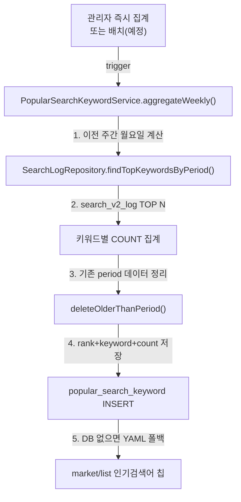

# 🏘️ NeighborTrade - 동네 직거래 커뮤니티 플랫폼

> **문서 스냅샷:** README-NeighborTrade_20260618목  
> **기준 저장소:** [github.com/phyun0920/NeighborTrade](https://github.com/phyun0920/NeighborTrade)  
> **작성일:** 2026년 6월 18일 (목)

---

## 🎯 프로젝트 소개

🏷 **프로젝트 명 : NeighborTrade (동네직거래)**

🗓️ **프로젝트 기간 : 2026.05 ~ 진행 중**

👥 **구성원 : 개인 프로젝트**

🔗 **저장소 :** [github.com/phyun0920/NeighborTrade](https://github.com/phyun0920/NeighborTrade) (Private)

---

### ✅ 서비스 소개

> 동네에서 직거래로 물건을 사고팔 수 있는 위치 기반 커뮤니티 플랫폼

사용자는 자신의 동네(근처 지역)를 기반으로 중고 물품을 등록·판매하고, 다른 이웃들의 상품을 탐색하며 안전하게 거래할 수 있습니다.
동네 생활 커뮤니티 게시판, 1:1 채팅, 거래 요청·후기, 신고 기능을 통해 지역 기반 중고거래 경험을 제공합니다.
관리자는 통합 관리자 UI에서 회원·판매글·동네·신고·인기검색어·검색 로그를 운영합니다.

#### 핵심 특징

- **위치 기반 거래**: 동네 선택·인증을 기반으로 근처 판매자와 상품 발견
- **카테고리별 탐색**: 전자제품, 의류, 가구 등 다양한 카테고리 필터링
- **검색 로깅 및 인기검색어**: 검색 기록 저장, 주간 인기검색어 집계·표시
- **거래·채팅·후기**: 거래 요청/수락/완료 흐름, WebSocket 채팅, 매너 후기
- **커뮤니티**: 동네 생활 게시판 및 댓글
- **반응형 디자인**: 데스크톱·태블릿·모바일 최적화 UI

---

### 👥 서비스 대상

- 동네에서 물건을 사고팔고 싶은 개인 판매자 및 구매자
- 안전하고 편리한 중고거래 경험을 원하는 사용자
- 지역 커뮤니티 활성화에 관심 있는 주민

---

## 🛠 기술 스택

### Backend

<p>
  
  
  
  
  
  
</p>

### Frontend

<p>
  
  
  
  
  
</p>

### Database & GIS

<p>
  
  
  
  
</p>

### Build & DevOps

<p>
  
  
  
</p>

### Tools & Collaboration

<p>
  
  
</p>

---

## ✨ 핵심 기능

### 👤 일반 사용자 시나리오

#### 1단계 — 회원가입 / 로그인

- 이메일·비밀번호 회원가입 또는 **카카오 · 네이버 소셜 로그인**
- 소셜 최초 가입 시 자동 회원 생성, 동일 이메일 재접속 시 기존 계정 연동
- 비로그인 사용자도 중고거래·커뮤니티 목록·상세 조회 가능

#### 2단계 — 위치 선택 & 상품 탐색

- **동네 선택**(쿠키 기반 탐색 지역) 및 **동네 인증**
- 카테고리·키워드 검색, 주간 **인기검색어 칩** 표시
- 검색 시 `search_v2_log`에 검색 기록 자동 저장

#### 3단계 — 상품 판매 (판매자)

- 상품 등록·수정·삭제 (제목, 설명, 카테고리, 가격, 상태, 이미지)
- 거래 상태 관리 (판매중 / 예약중 / 판매완료)
- **끌올(Bump)**: 24시간 쿨타임 후 노출 시간 갱신

#### 4단계 — 즐겨찾기 & 내 판매 관리

- 관심 상품 **즐겨찾기** 추가·해제
- **내 판매글** 목록에서 상태·끌올 관리

#### 5단계 — 거래 · 채팅 · 후기

- 구매자가 **거래 요청** → 판매자 **수락/거절** → **거래 완료**
- 상품 상세에서 **1:1 채팅** 시작 (WebSocket)
- 거래 완료 후 **매너 후기** 작성

#### 6단계 — 커뮤니티 & 신고

- 동네 생활 **커뮤니티** 글·댓글 작성
- 부적절한 상품·게시글 **신고**

---

### 🛠️ 관리자 시나리오 (통합 UI — 2026.06.16)

사이드바 기반 **관리자 통합 레이아웃** (`admin-layout.html`)으로 운영합니다.

| 메뉴 | 경로 | 설명 |
|------|------|------|
| 대시보드 | `/admin/dashboard` | 회원·판매글·거래·커뮤니티·신고·인기검색어·검색로그 요약 |
| 회원관리 | `/admin/members` | 회원 목록, 역할·인증 동네·매너점수 조회 |
| 판매글관리 | `/admin/posts` | 판매글 목록, 부적절 글 숨김 처리 |
| 동네관리 | `/admin/neighborhoods` | 동네(지역) 목록 조회 |
| 신고관리 | `/admin/reports` | 신고 접수·처리 (상태 변경, 처리 메모) |
| 인기검색어관리 | `/admin/popular-keywords` | 주간 집계 결과 조회·수정·삭제, **즉시 집계** 실행 |
| 검색 로그 | `/admin/search-logs` | `search_v2_log` 읽기 전용 조회 (최근 7일 건수 표시) |

---

## 💌 개발 진행 현황

### Phase 1 ~ 2 (완료)

- 회원가입·로그인, OAuth2 소셜 로그인 (카카오·네이버)
- 중고거래 상품 CRUD, 카테고리·위치 필터링
- 동네 인증, 이미지 업로드, Railway 배포 기반 구성

### Phase 3 (완료)

- **Step 1**: PC 헤더·네비게이션 통일
- **Step 2 (C1)**: 동네생활 list·detail 비로그인 공개, browsing 동네 필터
- **Step 3 (U9)**: 끌올(Bump) 기능, `MarketProperties` 쿨타임 설정
- **Step 4 (B7-2)**: 인기검색어 — `search_v2_log` 저장, `popular_search_keyword` 주간 집계, 화면 칩 표시
- **Step 5**: 모바일 지역 선택 UX 개선
- **Step 6 (COM·ADM)**: 동네생활·관리자 대시보드 v2 UI, 반응형 개선
- **Admin UI 통합 (2026.06.16, Step C)**: 관리자 사이드바·검색 로그·인기검색어 관리 UI

> **참고:** 인기검색어 주간 집계는 관리자 **즉시 집계**로 운영 중이며, 매주 월요일 자동 스케줄(`@Scheduled`)은 향후 개선 항목입니다.

---

## 🏗 시스템 아키텍처

```
User (Browser)
   ↓
Thymeleaf Templates (HTML/CSS/JS)
   ↓
Spring Boot Controller Layer
   ↓
Service Layer (Business Logic)
   │
   ├─ ProductPostService      (상품 CRUD·끌올·숨김)
   ├─ SearchLogService        (검색 로깅)
   ├─ PopularSearchKeywordService (인기검색어 집계·조회)
   ├─ ProductFavoriteService  (즐겨찾기)
   ├─ TradeService            (거래 요청·수락·완료)
   ├─ ChatService             (채팅방·메시지)
   ├─ CommunityService        (커뮤니티·댓글)
   ├─ ReviewService           (매너 후기)
   ├─ ReportService           (신고 처리)
   └─ LocationService         (동네 인증)
   ↓
Repository Layer (JPA)
   ↓
Database (PostgreSQL / Supabase / H2)
   ├─ product_post, product_image, product_favorite
   ├─ search_v2_log, popular_search_keyword
   ├─ trade, chat_room, chat_message
   ├─ community_post, community_comment
   ├─ review, report
   ├─ member, neighborhood, location_verification
   └─ ...

WebSocket (STOMP)
   └─ 실시간 채팅 메시지
```

---

## 🗂 프로젝트 구조

```
NeighborTrade/
├── src/main/java/com/study/neighbortrade/
│   ├── config/
│   │   ├── MarketProperties.java
│   │   ├── SecurityConfig.java
│   │   ├── WebSocketConfig.java
│   │   └── RailwayProductionProfilePostProcessor.java
│   │
│   ├── controller/
│   │   ├── MarketController.java
│   │   ├── MarketFavoriteController.java
│   │   ├── CommunityController.java
│   │   ├── ChatController.java
│   │   ├── TradeController.java
│   │   ├── ReviewController.java
│   │   ├── ReportController.java
│   │   ├── LocationController.java
│   │   ├── AdminController.java
│   │   └── ...
│   │
│   ├── domain/
│   │   ├── product/          # ProductPost, ProductImage, ProductFavorite ...
│   │   ├── search/           # SearchLog, PopularSearchKeyword
│   │   ├── community/        # CommunityPost, CommunityComment
│   │   ├── chat/             # ChatRoom, ChatMessage
│   │   ├── trade/            # Trade
│   │   ├── review/           # Review
│   │   ├── report/           # Report
│   │   ├── location/         # Neighborhood, LocationVerification
│   │   └── member/           # Member, MemberRole
│   │
│   ├── service/                # 비즈니스 로직
│   ├── repository/             # JPA Repository
│   └── NeighborTradeApplication.java
│
├── src/main/resources/
│   ├── templates/
│   │   ├── market/             # list, detail, form, my, favorites
│   │   ├── community/          # list, detail, form
│   │   ├── chat/               # rooms, room
│   │   ├── trade/              # list, detail
│   │   ├── admin/              # dashboard, members, posts, reports,
│   │   │                       # popular-keywords, search-logs, neighborhoods
│   │   └── fragments/          # header, admin-layout, market-search-band,
│   │                           # market-popular-keywords, ...
│   │
│   ├── static/css/common.css
│   ├── static/js/
│   ├── application.yml           # 로컬 기본 설정 (민감 정보는 secret 분리)
│   ├── application-prod.yml    # Railway·운영 프로필
│   ├── application-secret.yml    # gitignore — DB·OAuth 키 등
│   └── neighborTrade_db*.sql     # DB 스키마 참고 SQL
│
├── railway.toml                  # Railway 빌드·실행 설정
├── build.gradle
└── README.md
```

---

## 📡 주요 API·화면 엔드포인트

### 중고거래 (Market)

| 메소드 | 경로 | 설명 | 인증 |
|--------|------|------|------|
| GET | `/market/list` | 상품 목록 (검색·카테고리·동네 필터) | 없음 |
| GET | `/market/detail/{id}` | 상품 상세 | 없음 |
| GET/POST | `/market/form` | 상품 등록 | 필요 |
| GET/POST | `/market/edit/{id}` | 상품 수정 | 필요 |
| POST | `/market/bump/{id}` | 끌올 | 필요 |
| POST | `/market/status/{id}` | 거래 상태 변경 | 필요 |
| GET | `/market/my` | 내 판매글 | 필요 |
| POST | `/market/favorite/{postId}` | 즐겨찾기 토글 | 필요 |
| GET | `/market/favorites` | 즐겨찾기 목록 | 필요 |

### 거래 · 채팅 · 후기 · 커뮤니티

| 메소드 | 경로 | 설명 | 인증 |
|--------|------|------|------|
| POST | `/trade/request/{postId}` | 거래 요청 | 필요 |
| GET | `/trade/list` | 거래 목록 | 필요 |
| POST | `/trade/accept/{id}` 등 | 거래 수락·완료·취소 | 필요 |
| POST | `/chat/start/{productPostId}` | 채팅방 시작 | 필요 |
| GET | `/chat/rooms`, `/chat/room/{roomId}` | 채팅 목록·방 | 필요 |
| GET/POST | `/review/form/{tradeId}` | 후기 작성 | 필요 |
| GET | `/community/list` 등 | 커뮤니티 CRUD·댓글 | 일부 필요 |
| GET/POST | `/report/{type}/{id}` | 신고 | 필요 |

### 관리자 (Admin)

| 메소드 | 경로 | 설명 | 인증 |
|--------|------|------|------|
| GET | `/admin/dashboard` | 대시보드 | ADMIN |
| GET | `/admin/members` | 회원 관리 | ADMIN |
| GET | `/admin/posts` | 판매글 관리 | ADMIN |
| POST | `/admin/posts/hide/{id}` | 판매글 숨김 | ADMIN |
| GET | `/admin/reports` | 신고 관리 | ADMIN |
| GET | `/admin/popular-keywords` | 인기검색어 관리 | ADMIN |
| POST | `/admin/popular-keywords/aggregate` | 즉시 주간 집계 | ADMIN |
| GET | `/admin/search-logs` | 검색 로그 조회 | ADMIN |

---

## 📊 데이터베이스 (주요 테이블)

스키마는 Hibernate `ddl-auto: update`로 동기화하며, 참고 SQL은 `src/main/resources/neighborTrade_db*.sql`에 있습니다.

### search_v2_log (검색 기록)

```sql
-- keyword, searched_at, browsing_neighborhood_id, member_id, product_count
```

### popular_search_keyword (주간 집계)

```sql
-- rank, keyword, search_count, period(월요일 기준), created_at, updated_at
```

---

## 🔄 인기검색어 집계 플로우



- DB에 집계 데이터가 없으면 `application.yml`의 `app.market.popular-keywords` 폴백 목록을 표시합니다.

---

## 🔧 로컬 개발 환경 설정

### 사전 요구사항

- **Java 21**
- **Gradle** (Wrapper 포함)
- **PostgreSQL** 또는 **H2** (로컬 테스트)

### 1단계 — 클론 및 빌드

```bash
git clone https://github.com/phyun0920/NeighborTrade.git
cd NeighborTrade
./gradlew clean build
```

Windows:

```powershell
.\gradlew.bat clean build
```

### 2단계 — 설정 파일

| 파일 | 설명 |
|------|------|
| `application.yml` | 기본 설정 (포트, JPA, UI 버전 등) |
| `application-secret.yml` | **gitignore** — DB URL, OAuth Client ID/Secret 등 민감 정보 |
| `application-prod.yml` | Railway·운영 프로필 (로그 레벨·SQL 출력 비활성화) |

`application-secret.yml` 예시 (로컬에서 직접 생성):

```yaml
spring:
  datasource:
    url: jdbc:h2:mem:neighbortrade;MODE=PostgreSQL;DATABASE_TO_LOWER=TRUE
    username: sa
    password:
  security:
    oauth2:
      client:
        registration:
          kakao:
            client-id: YOUR_KAKAO_CLIENT_ID
            client-secret: YOUR_KAKAO_CLIENT_SECRET
          naver:
            client-id: YOUR_NAVER_CLIENT_ID
            client-secret: YOUR_NAVER_CLIENT_SECRET
```

### 3단계 — 실행

```bash
./gradlew bootRun
```

브라우저: `http://localhost:8080` (기본 포트, `PORT` 환경변수로 변경 가능)

### 4단계 — PostgreSQL (선택)

```bash
docker run --name neighbortrade-db \
  -e POSTGRES_DB=neighbortrade \
  -e POSTGRES_USER=admin \
  -e POSTGRES_PASSWORD=password \
  -p 5432:5432 \
  -d postgres:15
```

`application-secret.yml`에 JDBC URL을 설정한 뒤 실행합니다.

---

## 🧪 테스트 실행

```bash
./gradlew test

# 특정 테스트
./gradlew test --tests MarketControllerTest
./gradlew test --tests CommunityControllerTest
```

---

## 🚀 배포 (Railway)

`railway.toml` 기준:

```toml
[build]
buildCommand = "sh gradlew bootJar -x test --no-daemon"

[deploy]
startCommand = "java -Dserver.port=$PORT -jar build/libs/NeighborTrade-0.0.1-SNAPSHOT.jar"
```

Railway Variables에 `DB_URL`, `DB_USERNAME`, `DB_PASSWORD`, OAuth 키 등을 등록합니다.
`RAILWAY_ENVIRONMENT` 감지 시 `prod` 프로필이 자동 적용되어 로그 폭주를 줄입니다.

---

## 🔥 주요 구현 사항 & 학습 포인트

### 1. 검색 로깅 & 인기검색어 (Phase 3 Step 4)

- 검색 시 `search_v2_log` 자동 저장
- 관리자 페이지에서 주간 TOP N **즉시 집계** (`aggregateWeekly`)
- YAML 폴백으로 DB 데이터 부재 시에도 인기검색어 UI 유지

### 2. 끌올(Bump) 기능 (Phase 3 Step 3)

- 24시간 쿨타임 (`app.market.bump-cooldown-hours`)
- `MarketProperties`로 설정 중앙화

### 3. 관리자 UI 통합 (2026.06.16)

- `admin-layout.html` 사이드바·모바일 토글 메뉴
- 대시보드 KPI, 검색 로그 읽기 전용 페이지

### 4. 거래·채팅·커뮤니티

- 거래 상태 머신 (요청 → 수락 → 완료)
- WebSocket(STOMP) 기반 1:1 채팅
- 커뮤니티 게시판·댓글, 관리자 숨김 처리

### 5. 운영·보안

- 이메일 마스킹 (`EmailMasking`) — 관리자 회원 목록
- Railway용 로그 레벨·ANSI 비활성화 (`application-prod.yml`)
- 한글 파일명 업로드 처리 (`FileStorageService`)

---

## 📚 참고 문서

- [Spring Boot 공식 문서](https://spring.io/projects/spring-boot)
- [Thymeleaf 공식 문서](https://www.thymeleaf.org/)
- [Railway 배포 가이드](https://docs.railway.com/)
- 저장소 README: `../README.md`

---

## 📞 문의 & 피드백

프로젝트 관련 질문이나 개선 제안은 GitHub Issues를 통해 남겨주세요.

---

## 📄 라이선스

이 프로젝트는 개인 포트폴리오 용도로 작성되었습니다.

---

**마지막 업데이트: 2026년 6월 18일 (목)**
